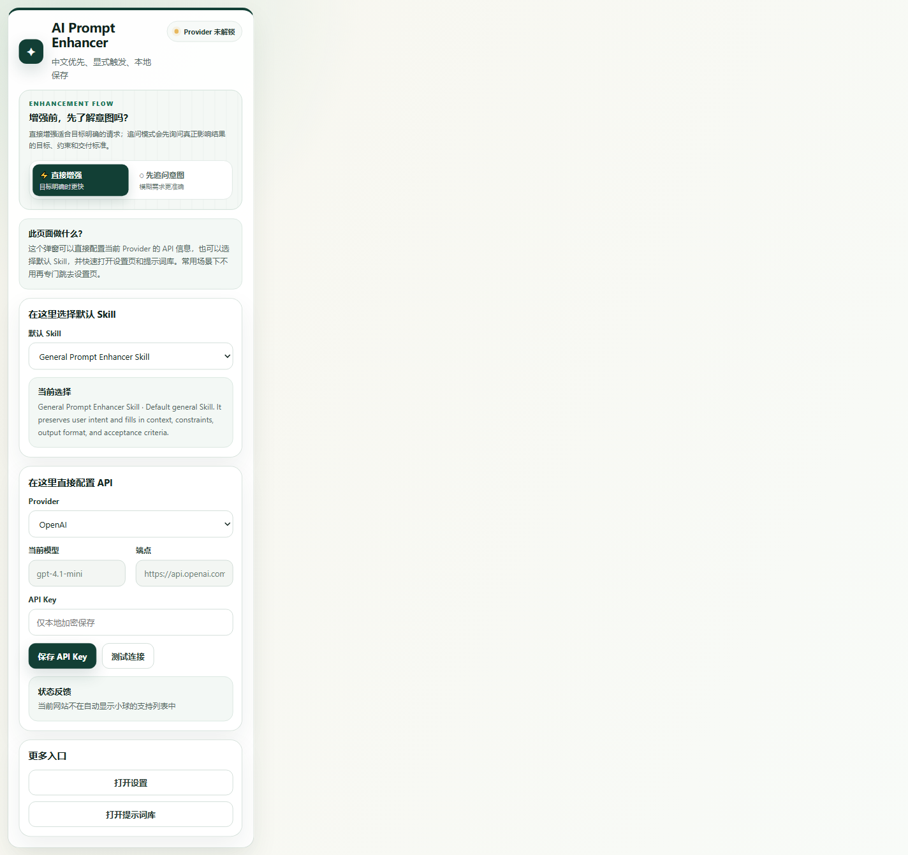
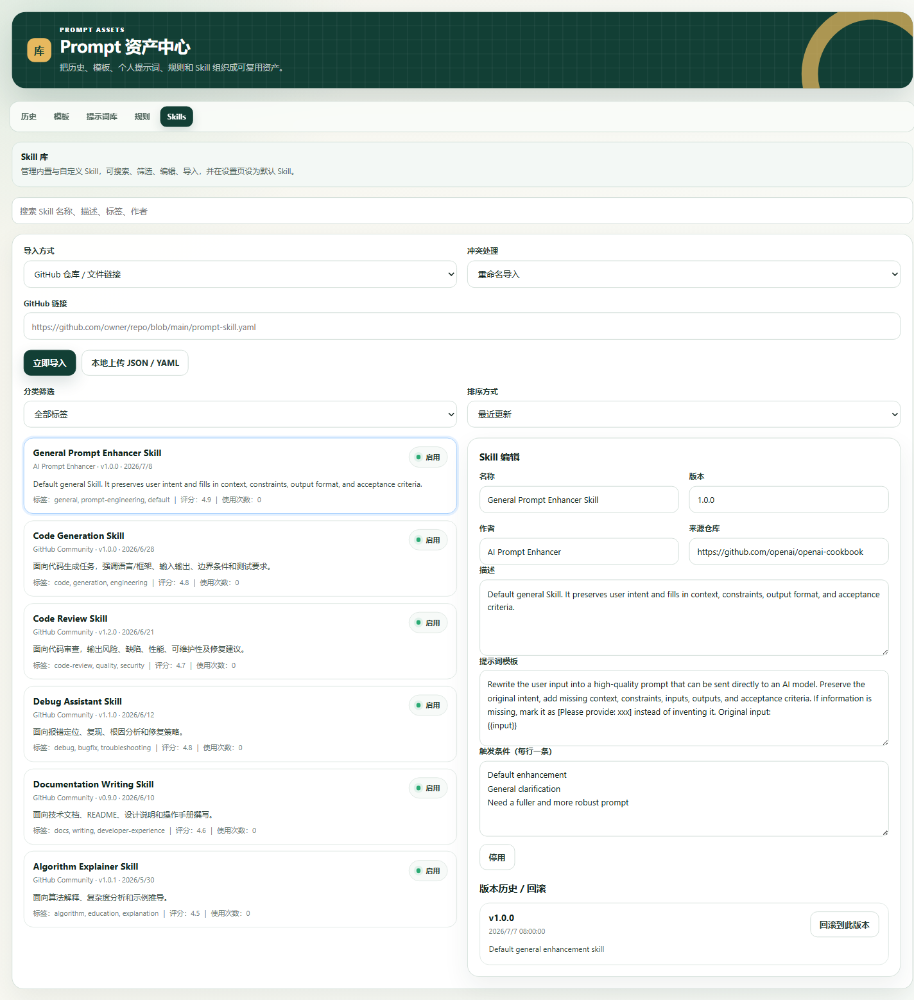
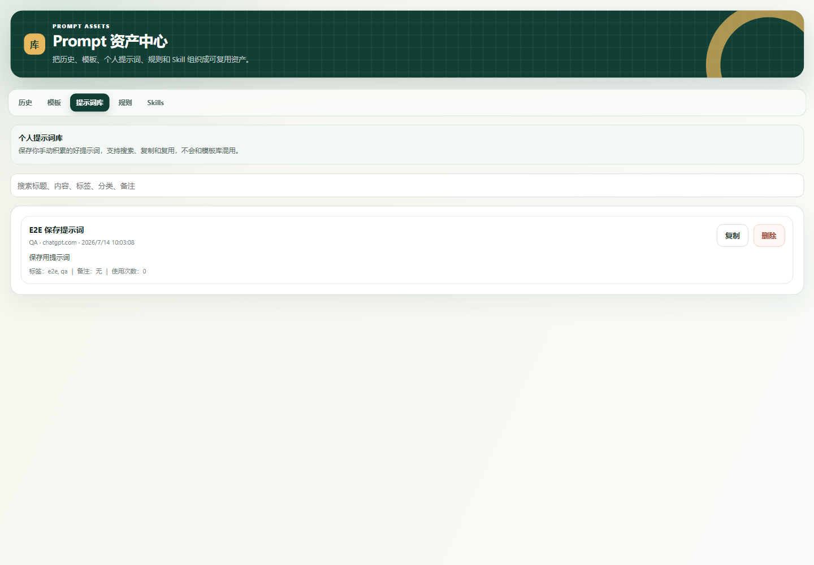
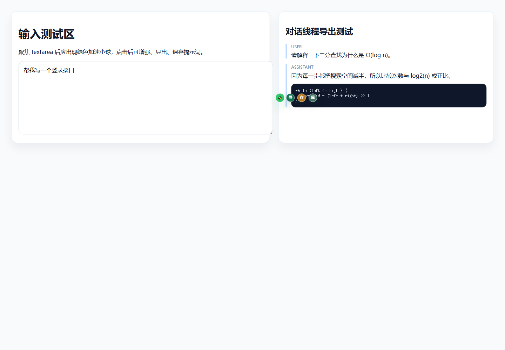
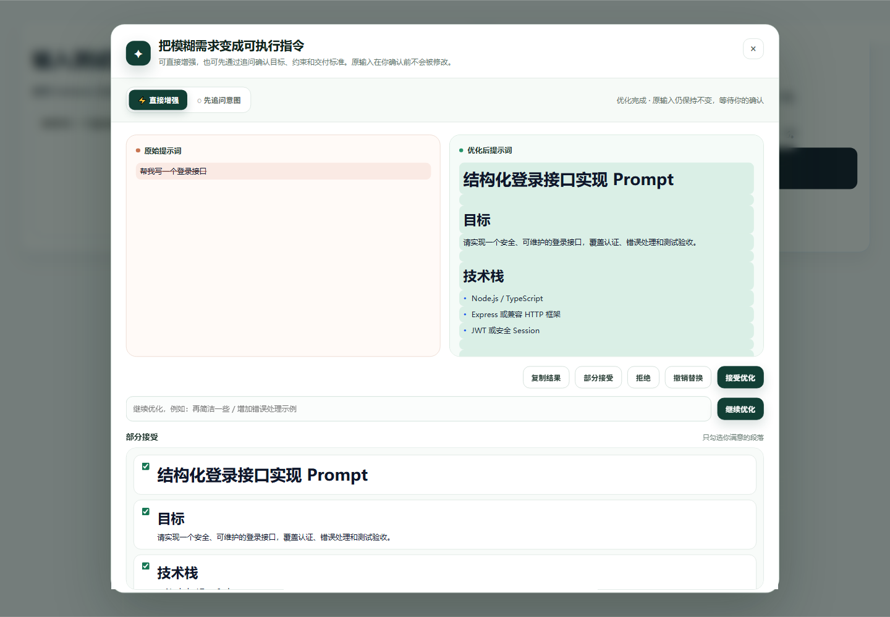
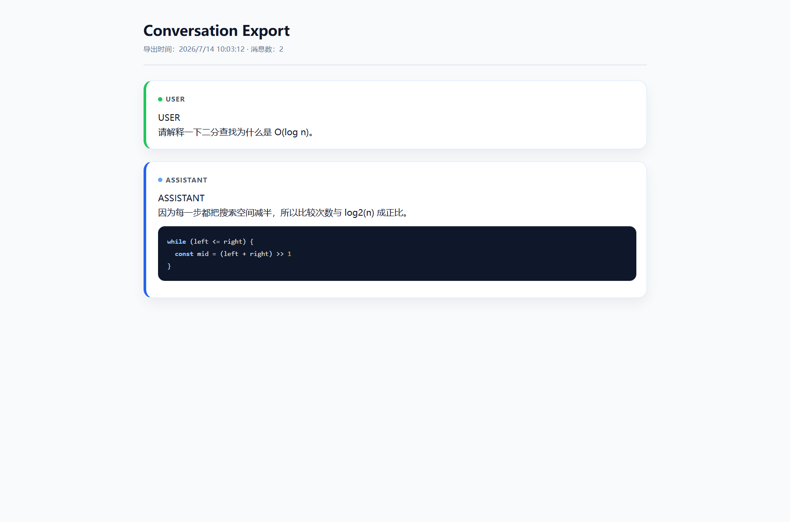

# AI Prompt Enhancer

一个中文优先、隐私可控的 Chrome MV3 提示词增强扩展。它把提示词优化、Skill 管理、多 Provider 配置、意图追问、对比确认、个人提示词库和对话导出放到用户正在使用的 AI 网页旁边。

> 当前版本：`0.1.0` · 开源协议：MIT · 不需要后端服务

项目地址：[github.com/Xiaoqiang-Huang/ai-prompt-enhancer-extension](https://github.com/Xiaoqiang-Huang/ai-prompt-enhancer-extension)

## 为什么做它

很多时候，问题不是“不会问”，而是不知道如何把目标、上下文、约束、输出格式和验收标准说清楚。AI Prompt Enhancer 不直接替换用户原文，而是先生成并展示一份可审阅的优化结果，由用户决定接受、拒绝、继续优化或部分接受。

## 功能概览

- **绿色小球入口**：在 ChatGPT、Claude、Gemini、DeepSeek、Copilot 等支持站点的输入框旁提供轻量入口，自动避让输入框。
- **Skill 驱动增强**：内置通用、代码、审查、文档、调试、算法解释等 Prompt Engineering Skill，可选择默认 Skill，也支持 GitHub、JSON/YAML 和粘贴文本导入。
- **意图追问模式**：信息不足时先提出针对性问题，再把回答带入下一轮增强。
- **多 Provider**：支持 OpenAI、Anthropic、Google Gemini、Azure OpenAI、Ollama、DeepSeek、Kimi、通义千问、智谱、硅基流动、火山方舟和自定义兼容端点。
- **流式与兼容处理**：支持常见 OpenAI-compatible、Anthropic、Gemini、Ollama 响应格式，并对长输出、截断和重试做兼容处理。
- **确认式工作流**：原始提示词与优化后提示词并列展示，支持差异高亮、复制、接受、拒绝、继续优化和部分接受。
- **个人提示词库**：保存输入、选区、消息或增强结果，支持标签、分类、备注、复制和使用次数。
- **对话导出**：把当前页面可见对话导出为 Markdown、HTML、JSON、TXT，PDF 通过可打印 HTML 页面生成并保留代码块样式。
- **本地控制**：历史、原文保存、敏感信息检测、入口显示和 Provider 配置均可在本地设置中管理。

## 截图

| Popup | Skill 库 | 个人提示词库 |
| --- | --- | --- |
|  |  |  |

| 输入框入口 | 对比确认 | 导出打印页 |
| --- | --- | --- |
|  |  |  |

## 安装

### 从源码加载

1. 安装 Node.js 20+。
2. 克隆仓库并安装依赖：

   ```bash
   npm install
   ```

3. 构建扩展：

   ```bash
   npm run build
   ```

4. 打开 Chrome 的 `chrome://extensions`，开启“开发者模式”。
5. 点击“加载已解压的扩展程序”，选择项目中的 `dist` 目录。

### 配置 Provider

打开扩展 Popup 或 Options 页面，选择 Provider、模型、端点和参数，填入自己的 API Key。API Key 只在本地扩展存储中加密保存，项目不会接收或托管任何 Key。Ollama 可以使用本地端点，不需要云端 Key。

## 支持站点与权限

默认内容脚本只覆盖明确支持的站点，不使用 `<all_urls>`，也不请求 `tabs` 权限。其他网站需要用户主动触发并授予可选站点权限。完整说明见：

- [隐私政策](docs/privacy-policy.md)
- [权限说明](docs/permissions.md)
- [Chrome Web Store 文案](docs/chrome-web-store-listing.md)

## 开发与验证

```bash
npm run typecheck
npm run test:run
npm run lint
npm run build
npm run test:e2e
```

E2E 使用本地 fixture 和本地 mock Provider，不调用真实 OpenAI、Claude、Gemini 或其他第三方 API。发布前检查清单见 [docs/release-checklist.md](docs/release-checklist.md)，项目介绍文章见 [docs/blog-bilibili-entry.md](docs/blog-bilibili-entry.md)。

## 安全边界

- 插件不运行远程 Skill 代码；GitHub 导入只解析 JSON/YAML 配置。
- 只有用户显式点击增强、保存或导出时，插件才处理对应内容。
- 敏感信息检测开启时，疑似 Key、Token、密码等内容会在本地阻止增强。
- 插件没有开发者后端，不出售用户数据，也不用于广告画像。
- 第三方 Provider 的数据处理遵循用户选择的服务商政策。

## 参与贡献

欢迎提交新的 Skill、Provider 兼容性修复、站点定位规则和测试用例。请先阅读 [CONTRIBUTING.md](CONTRIBUTING.md)；发现安全问题请按 [SECURITY.md](SECURITY.md) 联系维护者。

## 许可证

本项目使用 [MIT License](LICENSE)。
